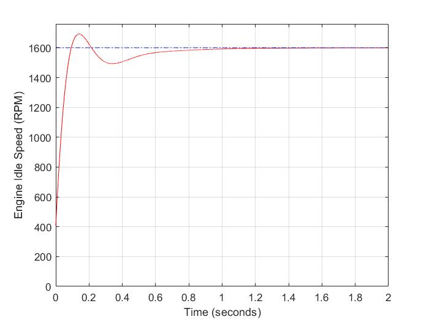
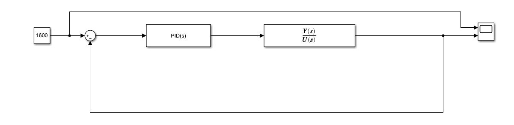
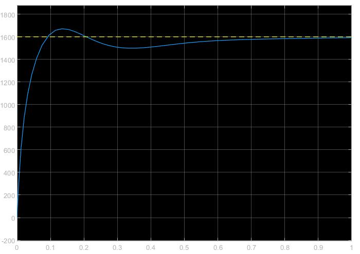

---

 # **A simple PID implementation in MATLAB/Simulink**

---

It's a linearized Engine Idle Speed Model which is controlled by a PID Controller.

In 

 

Fig.1 – Results of .m file

 

 

Fig.2 – Simulink Model

 

 

Fig.3 – Results of Simulation wit Simulink

 